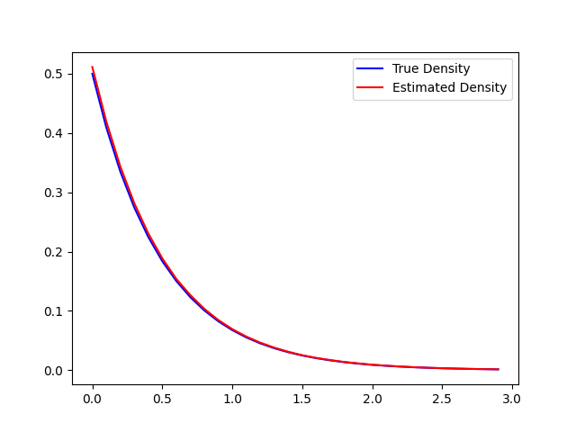

# Squared Neural Families

This is based on [Squared Neural Families](https://arxiv.org/pdf/2305.13552.pdf) from NeurIPS 2023. They authors propose a new class of models based on neural networks that serve as probability density functions. A little more formally, the authors propose a parameterization of density models, whose parameters are based on the weights and biases of a network. Note that while this is a parametric model for densities, it is not necessarily identifiable, as different sets of parameters can produce the same density function.

## Prerequisites

### From Statistics 

It is common in Bayesian statistics to deal with complicated density functions, and oftentimes, the normalizing constant is unknown. The most common way to normalize a probability density function is by the following:

$$
f(x) = \frac{g(x)}{\int g(x) d\mu(x)} 
$$

where $\mu(x)$ is the measure on $x$ to which $g$ is integrated.

Integration of $g$ may be intractable, so we invoke the law of large numbers and perform stochastic integration. $\mu(x)$ luckily gives us a base measure, and we can generate samples from the random variable associated with the base measure. Then $\int g(x)d\mu(x) = E(g(X))$. So $E(g(X))$ can be approximated with $\frac{1}{N} \sum_{i=1}^N g(X_i)$ where $X$ is sampled from some underlying distribution with respect to the base measure $\mu$. This converges in probability to $E(g(X))$ per LLN.

### From Linear Algebra

Matrix multiplication is the core of neural networks. The weights and biases are matrices, and activations are applied element-wise. Likewise, integration of a matrix is also performed element-wise.


## Squared Neural Families

Suppose we have a function $f(x; \theta)$ which is a neural network of the form $f(x; \theta) = V\sigma(Wx +B)$. This is a 2 layer neural network, with no bias on the second layer, and activation function $\sigma(.)$. $f$ is not guaranteed to be $\geq 0$, which is a requirement for normalizable functions for use as probabilities. To rectify this, simply square the function (in the case of vector valued $f$, take the square of the Euclidean norm).

Let $\sigma(\Theta) := \sigma(Wx+B)$. Thus $\|f\|_2^2 = f^T f$ gives:

$$
(f^T f)(x) = \sigma^T(\Theta)V^T V \sigma(\Theta) \geq 0
$$

To normalize this function, divide it by its integral, with respect to the measure of $x$. Probability densities that can be expressed as the following are belong to the SNEFY (Squared Neural Family) class of distributions.

$$
P(dx) = \frac{f^Tf}{\int f^T f d\mu(x)} \mu(dx) = \frac{\sigma^T(\Theta)V^T V \sigma(x)}{\int \sigma^T(\Theta)V^T V \sigma(\Theta) \mu(dx) } \mu(dx)
$$

To understand this function better, let $x \in \mathbf{R}^{N x 1}$, $W \in \mathbf{R}^{M \times N}$ and $V \in \mathbf{M \times O}$. Thus the network $f$ takes the $N$ vector and casts it to $O$ dimensional space, with one hidden layer of size $M$. 

$Wx + B$ is a $M \times 1$ vector, and the activation is applied element-wise, so it does not affect dimensionality. $\sigma(\Theta)^T$ is $1 \times M$ and $V^T$ is $M \times O$ therefore, $\sigma(\Theta)^T V^T$ is $1 \times O$. Likewise, $V\sigma(\Theta)$ is $O \times 1$, so $f^T f$ is representable as a scalar, which is the same as its trace.

In fact, this all holds true even if we have $Wt(x) + B$, where $t(.)$ is some function applied onto $x$ either element-wise or batch-wise. What exactly goes into the scalar of $f^T f$? Note that $\sigma(\Theta)$ is:

$$
\begin{bmatrix}
\sigma(W_{1\cdot} \cdot t(x) + B_1) \\
\sigma(W_{2\cdot} \cdot t(x) + B_2) \\
\vdots \\
\sigma(W_{m\cdot} \cdot t(x) + B_m) 
\end{bmatrix}
$$

So $f = V\sigma(\Theta)$ is:

$$
\begin{bmatrix}
V_{1\cdot} \sum_{i=1}^m \sigma(W_{i\cdot} \cdot t(x) + B_i) \\
V_{2\cdot} \sum_{i=1}^m \sigma(W_{i\cdot} \cdot t(x) + B_i) \\
\vdots \\
V_{O\cdot} \sum_{i=1}^m \sigma(W_{i\cdot} \cdot t(x) + B_i) \\
\end{bmatrix}
$$

Thus $f^T f$ becomes:

$$
\sum_{k=1}^m \sum_{i=1}^m \sigma(W_{i\cdot} \cdot t(x) + B_i)^T V_{k\cdot}^T V_{k\cdot}  \sigma(W_{i\cdot} \cdot t(x) + B_i) 
$$

This is the trace of $\sigma^T(\Theta) V^T V \sigma(\Theta)$. By the cycle property of the trace:

$$
tr(\sigma^T V^T V \sigma) = tr(V^T V \sigma \sigma^T)
$$

Therefore, we can conclude that 

$$
d\nu(x) = \frac{tr(V^T V \sigma(Wt(x) +B) \sigma^T(Wt(x) +B))}{\int tr(V^T V \sigma(Wt(x) +B) \sigma^T(Wt(x) +B)) d\mu(x)}
$$

Here $V^T V$ is an $M \times M$ matrix, and $\sigma(Wt(x) +B) \sigma(Wt(x) + B)$ is also $M \times M$. The trace of this matrix is the sum of its diagonal which is a finite sum, so we can interchange the trace and integration in this case. Furthermore, $V$ does not depend on $x$ so it can be taken out of the integral. So now we have:

$$
d\nu(x) = \frac{tr(V^T V \sigma(Wt(x) +B) \sigma^T(Wt(x) +B))}{tr \left(V^T V \int \sigma(Wt(x) +B) \sigma^T(Wt(x) +B) d\mu(x)\right)}
$$

Thus we are able to parameterize a probability density function with traces of the weights of a 2 layer neural network.

## In Practice

For simplicity, let $x$ be values between (0, 10) and $y = \exp(-2x)$. This is the kernel for the exponential distribution with rate 2. It needs a normalizing constant of 2 in the denominator. To implement this SNEFY, first we define the two layer neural network.

```
# Define Network Architecture
import torch.nn as nn

class Network(nn.Module):
    def __init__(self, input_size, hidden_size, output_size, activation):
        self.layer1 = nn.Linear(input_size, hidden_size)
        self.layer2 = nn.Linear(hidden_size, output_size, bias = False)
        self.activate = activation

    def forward(self, x):
        out = self.layer1(x)
        out = self.activate(out)
        out = self.layer2(out)
        return out
```

Now, we define the estimator. We assume a standard Gaussian base measure.

```
# import your network as well as Network
import torch

class Exponential:
    def __init__(self, in_size, hidden_size, out_size, activate):
        self.in_size = in_size
        self.model = Network(in_size, hidden_size, out_size, activate)
        self.layer1 = dict()

        self.model.layer2.register_forward_hook(self._get_post_activation())

    def _get_post_activation(self):
        def hook(module, input, output):
            self.layer1['l1'] = input 
        return hook 

    def t(self, x):
        # identity
        return x

    def get_integrated_sigma(self, n_samples):
        dist = torch.distributions.Normal(loc = torch.Tensor([0]), scale = torch.Tensor([1]))
        samples = dist.rsample((n_samples, self.in_size))
        with torch.no_grad():
            _ = self.model(self.t(x))

        post_activate = self.layer1['l1'].unsqueeze(2)
        post_activate = post_activate @ post_activate.permute((0,2,1))
        K = torch.mean(post_activate, dim=0)
        return K

    def get_density(self, x):
        _V = self.model.layer2.weights
        VTV = _V.permute((-1, -2)) @ _V 

        with torch.no_grad():
            _ = self.model(x)
        post_activate = self.layer1['l1']
        K = post_activate @ post_activate.permute((-1, -2))

        normalizer = torch.trace(VTV @ self.integrated_sigma(1000))
        density = torch.trace(VTV @ K)

        return density / normalizer
```
Here, 

- `_get_post_activation()` registers the hook to get the values of the layer post activation
- `t()` is the data preprocessing transform
- `get_integrated_sigma()` uses LLN to estimate the integral of the activation function with respect to a Gaussian base measure
- `get_density()` produces the density estimate for a given input $x$, by calculating the activation of input $x$, $V^T V$, the normalizer.

To make it estimate an exponential distribution:

```
# import the estimator as Estimator
# import matplotlib.pyplot as plt

if __name__ == '__main__':
    x = torch.rand((1000, 1)) * 10
    y = torch.sqrt(torch.exp(-2 * x[:,0]).unsqueeze(1))

    exp_model = Exponential(in_size=1, hidden_size=128, out_size=1)

    criterion = torch.nn.MSELoss()
    optim = torch.optim.NAdam(exp_model.model.parameters(), lr = 0.0001)

    for epoch in range(100):
        yhat = exp_model.model(x)
        loss = criterion(yhat, y)

        optim.zero_grad()
        loss.backward()
        optim.step()
    
    # at this point, the model should be trained to replicate the square root of the Exp(2) distribution

    with torch.no_grad():
        xx = np.arange(0, 3, step=0.1)
        fx = []
        for x in xx:
            fx.append(exp_model.get_density(torch.from_numpy(np.array([x])).to(dtype=torch.float32)))
    
    plt.plot(xx, fx, color='r')
    plt.show()
```

We expect this plot to show something very close to the true density. The following plots were generated with more efficient code, and produces estimates of the normalizing value.



The normalizing constant was estimated to be 1.9493. This is fairly accurate, as seen on the plot. The 2 layer network model will integrate to 1, but the reason the normalizing constant is different is an artefact of loss minimization when training the model to fit y onto x.

## Statistical Extensions

With a new class of distributions, a few things can be discussed about its statistical properties. These proofs are detailed in the paper, but some very high level proof outlines are provided. Maybe they will be discussed here one day.

### Maximum Likelihood Estimation

With a model being parameterized by a finite dimensional parameter space, maximum likelihood can be used to fit the parameters. Under the usual maximum likelihood assumptions, assume the data is sampled from a SNEFY class. Then we can minimize the negative log likelihood. 

### Marginals and Conditionals

Let $Z = (X_1, X_2)$ be a joint SNEFY distribution. So $P(dz) \propto tr(V\sigma(W_1t_1(x_1) + B_1 + W_2t_2(x_2) + B_2) d\mu(z)$. Futhermore let the base measure $\mu(z) = \mu(x_1)\mu(x_2)$, Then the marginals $X_1$ and $X_2$ are also SNEFY. This can be proven by integrating out the respective marginal, and leveraging the property of traces and integrals, and independent base measures. Likewise, it is straight forward to show that the joint distribution also yields SNEFY classed conditional distirbutions. 

### Sufficient Statistics

We can easily factor the SNEFY density into a function that depends on $X$ via $T(X)$, the transformation, and another portion that does not depend on the parameters $W, B, V$. Thus by the Fisher-Neyman Factorization Theorem, $T(X)$ is a sufficient statistic. While this result is not fascinating in itself, it allows for better understanding of statistic inference on data distributions that can be parameterized by SNEFY class distributions.


